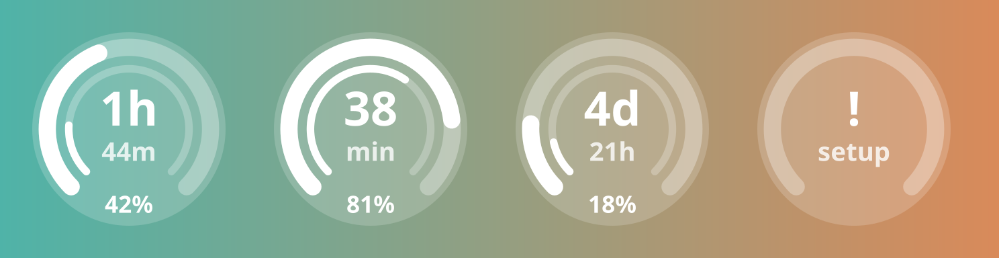
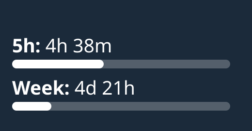

# claude-usage-widget

Your Claude usage limits on the iPhone lock screen: how much of the 5 hour and
weekly window you have used, and when each one resets. One JavaScript file that
runs in the free [Scriptable](https://apps.apple.com/app/scriptable/id1405459188)
app. No Mac, no Xcode, no App Store build.

## What it looks like

Lock screen widgets sit in the row under the clock (or the single line above it).
They are fixed there, not notifications, so there is nothing to swipe away.




*Mockups rendered from the script's own drawing code; on the phone iOS tints them
to match the lock screen.*

| Widget | Shows |
| --- | --- |
| Circular | bold outer arc = 5 h window used, thin inner arc = week used, center = time until the 5 h reset (`1h` big, `44m` small; under an hour `38` / `min`), bottom = 5 h percent. Parameter `7d` swaps the two windows |
| Rectangular | `5h: 4h 38m` and `Week: 4d 21h`, each with a bar for how much is used |
| Inline (above the clock) | `Claude 5h 42% · 4h 38m` |
| Home screen small / medium / large | same as rectangular, in color |

`unused` means the window has not started (or just reset). The countdown is
worked out when iOS redraws the widget, so between redraws it can run a few
minutes behind.

Tapping the widget opens claude.ai's usage page. If the widget needs you (not
set up, or the session expired) tapping it opens the script instead.

When the phone is offline or claude.ai is unreachable, the widget keeps showing
the last numbers it got and says why (`offline`) next to the 5h line. A
window whose reset time has passed shows 0% even before the next refresh.

## Setup

### 1. Install Scriptable

Free, from the App Store: <https://apps.apple.com/app/scriptable/id1405459188>

### 2. Get your session key

The widget logs in with the same cookie your browser uses. On the laptop:

1. Open <https://claude.ai> in Firefox (logged in).
2. Press `F12`, open the **Storage** tab, then **Cookies** > `https://claude.ai`.
3. Find the row `sessionKey`, double-click its value, copy it. It starts with
   `sk-ant-sid`.
4. Get it to the phone over something private, for example KDE Connect
   (`kdeconnect-cli -n <phone> --share-text <key>`). Avoid pasting it into chats.

This key is full access to your Claude account. The script keeps it in
Scriptable's keychain on the phone and only ever sends it to claude.ai. If you
log out of claude.ai in the browser the key stops working and the widget will
say **Session expired**; repeat this step then.

### 3. Add the script

1. Get the code onto the phone's clipboard, either way:
   - KDE Connect from the laptop:
     `kdeconnect-cli -n <phone> --share-text "$(cat claude-usage.js)"`
   - Or, logged in to GitHub in Safari (the repo is private), open
     `claude-usage.js`, tap **Raw**, long-press the text, **Select All**, **Copy**.
2. In Scriptable tap **+**, paste, tap the title at the top and name it
   `Claude Usage`.
3. Tap **Run** (bottom right). Paste the session key, tap **Save**.
4. You get a menu with your current usage. Use **Preview rectangular widget**
   to see the lock screen version. If it says **Blocked by Cloudflare**, see
   [Limitations](#limitations).

### 4. Put it on the lock screen

1. Long-press the lock screen, tap **Customize**, pick the lock screen.
2. Tap the widget area under the clock, choose **Scriptable**, add
   **Rectangular** (or **Circular**).
3. Tap the widget you just added. Set **Script** to `Claude Usage`. Leave
   **Parameter** empty, or type `7d` for a circular/inline widget that shows the
   weekly window.
4. For the inline version, tap the date above the clock instead and pick
   Scriptable there.

Run the script again any time for the menu: refresh, previews, replace or remove
the key.

## Limitations

- **Unofficial API.** It reads `claude.ai/api/organizations/{org}/usage`, the
  endpoint claude.ai's own settings page uses. Anthropic can change it any time;
  the widget then says **Unexpected reply**.
- **Refresh rate is up to iOS.** The script asks for a refresh every 5 minutes
  (and right after a 5 h reset), but iOS budgets widget updates and often waits
  15 to 60 minutes. The reset time is always right; the percent can lag. Running
  the script or opening Scriptable refreshes it.
- **Cloudflare.** claude.ai sits behind Cloudflare, which challenges plain
  command line clients (curl, Node). Scriptable uses Apple's own network stack
  like Safari does, which is expected to pass, but this is untested until it
  runs on a phone. If the widget says **Blocked by Cloudflare** on the phone,
  the fallback is to load the API inside Scriptable's built-in browser
  (`WebView`), which can solve the challenge. That is not built yet.

## Development

```sh
npm test                                     # 27 tests against a strict Scriptable mock
CLAUDE_SESSION_KEY=sk-ant-sid01-... npm run live   # real API, prints each widget's text
```

The mock in `test/scriptable-mock.js` only allows the properties and methods the
Scriptable docs list, so a misspelled API fails the tests instead of failing on
the phone. Node gets challenged by Cloudflare from most networks, so `npm run
live` printing **Blocked by Cloudflare** says nothing about the phone.

The parsing follows [claude-usage-meter](https://github.com/diglitch1/claude-usage-meter),
the Firefox extension that reads the same endpoint.
