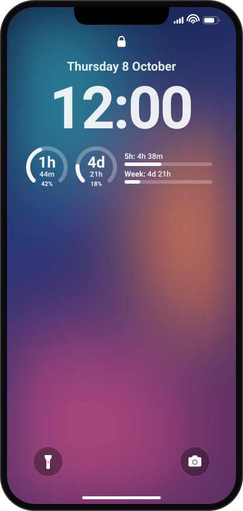
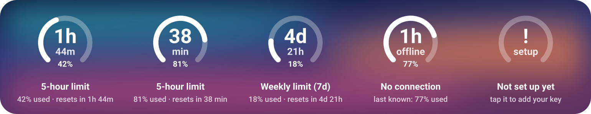

<div align="center">

# Claude Usage Widget

**Your Claude limits on the iPhone lock screen.**<br>
How much of the 5-hour and weekly window you have used, and when each one resets.



One JavaScript file for the free [Scriptable](https://apps.apple.com/app/scriptable/id1405459188) app.<br>
No Mac, no Xcode, no App Store build.

</div>

## What you see



| Widget | Shows |
| --- | --- |
| **Circular** | The ring fills up as you use the 5-hour window. The center counts down to the reset (`1h` / `44m`, under an hour `38` / `min`), the gap at the bottom gives the exact percent. Set the parameter to `7d` for the weekly window. |
| **Rectangular** | `5h: 4h 38m` and `Week: 4d 21h`: time until each reset, with a bar for how much is used. |
| **Inline** (above the clock) | `Claude 5h 42% · 4h 38m` |
| **Home screen** (small, medium, large) | The rectangular layout, in color. |

- **Tap** a widget to open claude.ai's usage page. When it needs you (not set up,
  session expired) a tap opens the script instead.
- **Offline?** It keeps the last numbers and says `offline`. A window whose reset
  time has passed drops to 0% on its own.
- `unused` means that window has not started yet.

## Setup

You need an iPhone on iOS 16 or later, and a few minutes.

### 1. Install Scriptable

Free from the App Store: [Scriptable](https://apps.apple.com/app/scriptable/id1405459188).

### 2. Get your session key

The widget signs in with the same cookie your browser uses on claude.ai.

1. On a computer, open [claude.ai](https://claude.ai) while logged in.
2. Open the developer tools (`F12`):
   - **Firefox:** **Storage** tab > **Cookies** > `https://claude.ai`
   - **Chrome / Edge:** **Application** tab > **Cookies** > `https://claude.ai`
3. Find the cookie named exactly **`sessionKey`**. Its value starts with
   `sk-ant-sid`. Double-click the value and copy it.
4. Send it to your phone over something private (AirDrop, KDE Connect, a note
   that does not sync to anyone else). Do not paste it into chats.

> [!WARNING]
> The session key is full access to your Claude account. The script stores it in
> Scriptable's keychain on your phone and only ever sends it to claude.ai.
> Logging out of claude.ai invalidates it; the widget then says
> **Session expired** and a tap lets you paste a new one.

### 3. Add the script

1. On the iPhone, open
   [`claude-usage.js` (raw)](https://raw.githubusercontent.com/diglitch1/claude-usage-widget/main/claude-usage.js)
   in Safari, long-press the text, **Select All**, **Copy**.
2. In Scriptable tap **+**, paste, and name the script `Claude Usage`.
3. Tap **Run** and paste your session key.
4. A menu shows your current usage. **Preview circular widget** and
   **Preview rectangular widget** show what the lock screen will look like.

### 4. Put it on the lock screen

1. Long-press the lock screen, tap **Customize**, then the lock screen.
2. Tap the widget row under the clock, choose **Scriptable**, and add a
   **Circular** or **Rectangular** widget.
3. Tap the widget you added and set **Script** to `Claude Usage`.
   For a weekly circle, set **Parameter** to `7d`.
4. For the inline line, tap the date above the clock and pick Scriptable there.

Run the script any time for the menu: refresh, previews, replace or remove the key.

## Good to know

- **Unofficial API.** The widget reads `claude.ai/api/organizations/{org}/usage`,
  the endpoint claude.ai's own usage page uses. If Anthropic changes it, the
  widget says **Unexpected reply** until the script is updated.
- **iOS decides when widgets refresh.** The script asks for every 5 minutes and
  right after a 5-hour reset, but iOS often waits 15 to 60 minutes, so the
  countdown can run a little behind. Running the script refreshes it.
- **Ring looks inset or clipped?** iOS adds a margin around Scriptable's
  circular widget, and the script pushes the ring back out by
  `CIRCULAR_BLEED` points (default `6`). Raise it if the ring sits inside the
  circle, lower it if the ring gets cut off.

## Development

```sh
npm test                                            # widget tests against a strict Scriptable mock
npm run mockups                                     # regenerate the README images in docs/
CLAUDE_SESSION_KEY=sk-ant-sid01-... npm run live    # real API, prints each widget's text
```

The mock in `test/scriptable-mock.js` only allows the properties and methods the
Scriptable docs list, so a misspelled API call fails the tests instead of failing
on the phone. The README images are drawn from the script's own drawing calls,
so they always match the code.

From a computer, claude.ai's Cloudflare usually blocks Node, so `npm run live`
saying **Blocked by Cloudflare** says nothing about the phone, where the request
goes through Apple's network stack like Safari.

Companion project: [claude-usage-meter](https://github.com/diglitch1/claude-usage-meter),
a Firefox extension that reads the same endpoint.
